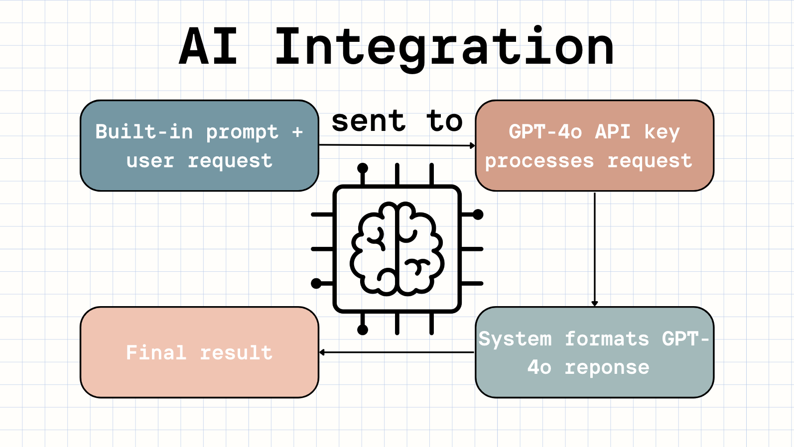
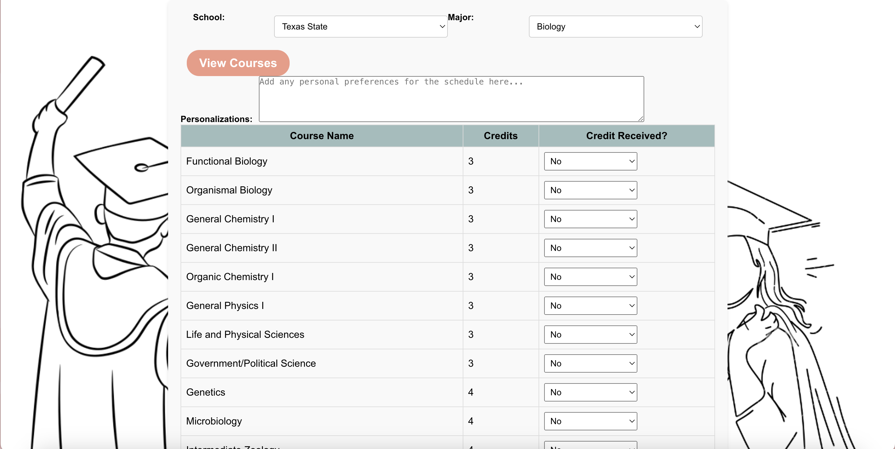
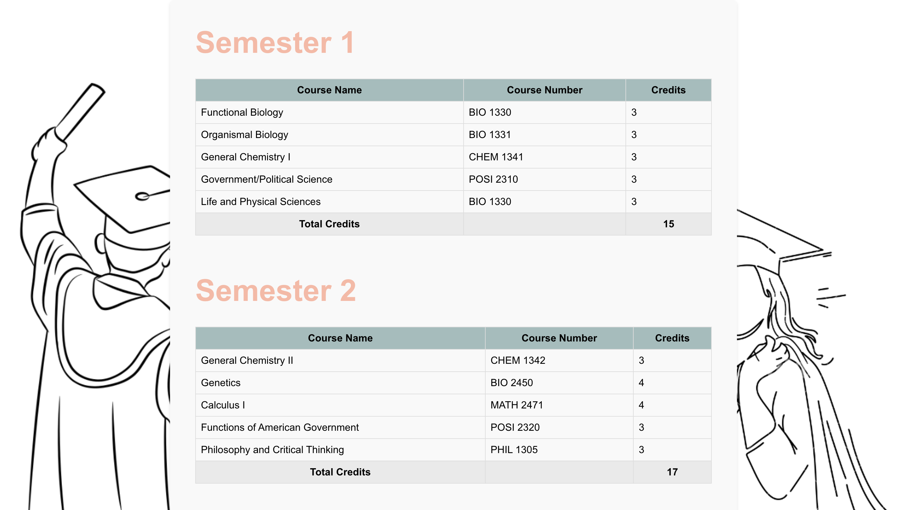
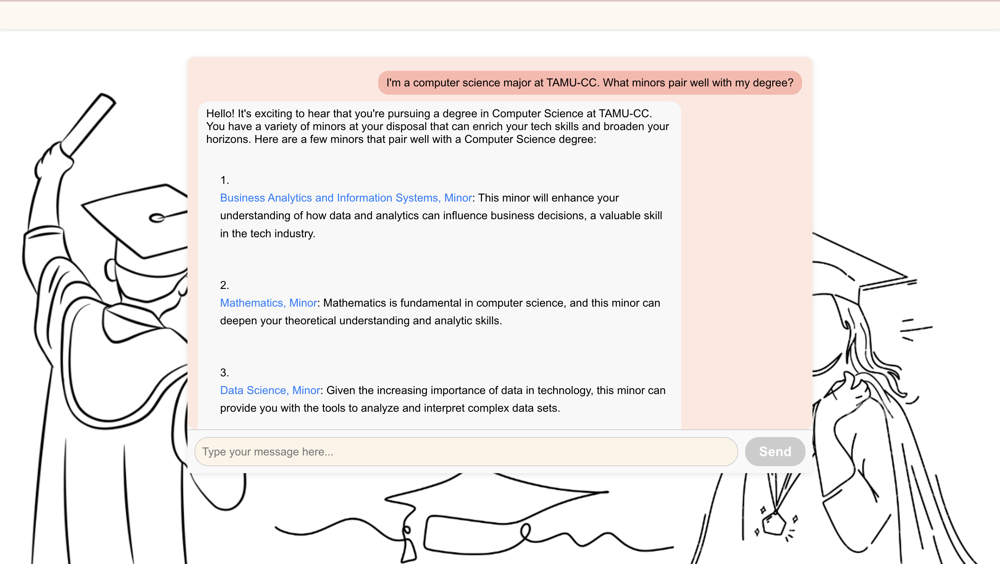
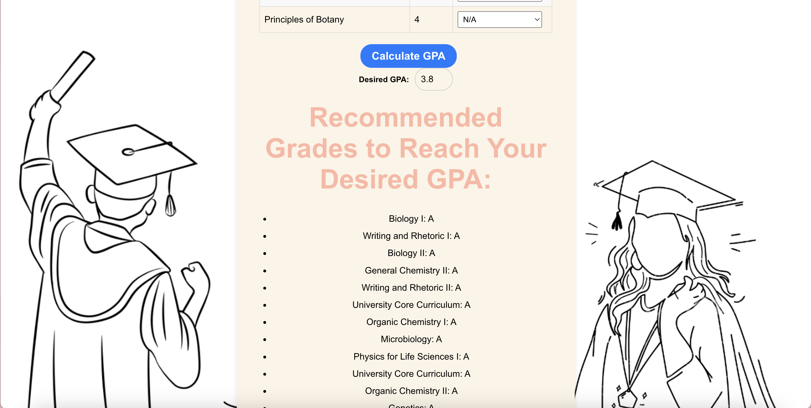

# EaseMyDegree - The future of academic planning.

<p align="center">
  
</p>

## Check it out live!
The EaseMyDegree site:
https://easemydegree.web.app/

About the project:
https://sites.google.com/view/easemydegree/home?authuser=0


## Overview
**EaseMyDegree** is an innovative, easy-to-scale web application built with React.js, Node.js, and OpenAI's GPT-4o, designed to help students create personalized semester-by-semester course plans. It also provides career advice based on the selected school and offers a GPA calculator for tracking academic performance.

## Brief Demo

<p align="center">
  <mov src="assets/EaseMyDegree_demo.mov" alt="Demo of EaseMyDegree" width="800"/>
</p>


## Features
- **Personalized Semester Planner**: Generates a semester plan based on user input and course data.
- **Career Advice**: Offers guidance and suggestions for career paths based on the user's major and school.
- **GPA Calculator**: Helps students determine the grades needed to achieve their desired GPA.
- **User-Friendly Interface**: Clean, intuitive design for easy navigation.
- **PDF Export**: Allows users to print or save their semester plan as a PDF file.
- **Dynamic Personalizations**: Customizable preferences to tailor the semester planner based on user-specific needs.

## Technologies Used
- **Frontend**: React.js (with standard `.js` files)
- **Backend**: Node.js
- **AI Integration**: OpenAI GPT-4o for generating course schedules and providing personalized career advice
- **PDF Generation**: `jsPDF` and `jspdf-autotable` for PDF export functionality
- **Data Handling**: `papaparse` for CSV parsing
- **HTTP Requests**: `axios` for making API calls
- **Deploying**: Firebase for hosting and deploying site

## Setup and Installation

### Prerequisites
- **Node.js** (version >= 14.x recommended)
- **npm** or **yarn** (package managers)

### Steps
1. **Clone the repository**:
    ```bash
    git clone https://github.com/malakamahdy/EaseMyDegree
    ```

2. **Navigate to the project directory**:
    ```bash
    cd easemydegree
    ```

3. **Install dependencies**:
    ```bash
    npm install
    ```
   or
    ```bash
    yarn install
    ```

4. **Set up environment variables**:
    Create a `.env` file in the root directory and add your OpenAI API key:
    ```bash
    REACT_APP_OPENAI_API_KEY=your_openai_api_key_here
    ```

5. **Run the development server**:
    ```bash
    npm start
    ```
   or
    ```bash
    yarn start
    ```

6. **Navigate to `http://localhost:3000`** in your browser to view the app.

## How GPT-4o is integrated



## Preview

### Dashboard
<p align="center">
  
</p>

### Semester Planner
<p align="center">
  
</p>

<p align="center">
  
</p>

### Career Counselor
<p align="center">
  
</p>

### GPA Calculator
<p align="center">
  
</p>

## Developer
- **Malak Mahdy**: Developed EaseMyDegree and degree offerings data sets.

- And thanks to:
- **Chantey Baca, Antonio Piñon, Jennifer Vasquez**: Contributed course plan data sets.
- **Syed Zaidi**: Login and registration functionality.


## Contact
For questions or feedback, please contact malakmahdy@gmail.com.

---

**EaseMyDegree** is designed to empower students with smart, personalized educational planning tools. Enjoy planning your semesters with ease and confidence!
